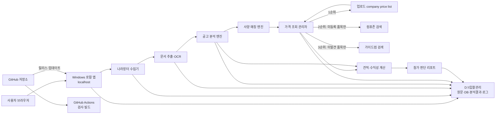
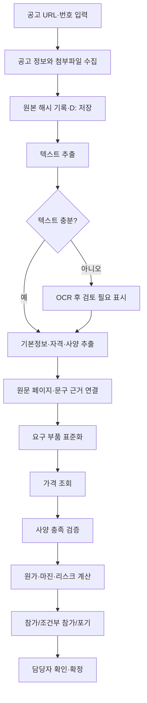

# 조달공고 분석 시스템 재설계안

## 1. 설계 목표

이 시스템은 나라장터 공고문과 첨부파일을 수집·분석하고, 요구 사양에 맞는 부품 구성과 원가를 계산하여 입찰 참가 판단 자료를 만든다.

- 앱의 소스, 버전, 이슈, 테스트와 배포 파일은 GitHub에서 관리한다.
- 앱은 Windows PC에서 실행하며 원본 공고문과 모든 분석 데이터는 `D:\입찰관리`에 저장한다.
- 가격은 업로드된 `company price list`를 가장 먼저 사용한다.
- 자사 가격표에 없는 품목만 컴퓨존, 그다음 가이드컴 순으로 검색한다.
- 외부 가격을 사용하면 상품명, 가격, 판매처, 조회 시각과 원문 링크를 결과에 반드시 남긴다.
- AI가 근거를 찾지 못한 내용은 추정하지 않고 `확인 필요`로 표시한다.
- 최종 참가 및 투찰 결정은 담당자가 한다.

## 2. 권장 전체 구조



### GitHub와 로컬 PC의 역할

| 영역 | 담당 기능 | 저장 데이터 |
|---|---|---|
| GitHub | 소스 관리, 버전 관리, 자동 테스트, Windows 설치 파일 또는 압축 배포본 생성 | 코드와 샘플 설정만 저장 |
| Windows 로컬 앱 | 공고 수집, 파일 파싱, OCR, 가격 검색, AI 분석 호출, 리포트 생성 | 실제 업무 데이터 |
| `D:\입찰관리` | 공고 원본, 추출문, 단가표, 가격 근거, 분석 결과, DB, 로그 | 모든 민감·업무 데이터 |

> GitHub Pages에서만 실행되는 순수 웹 앱은 보안상 `D:` 드라이브에 자유롭게 자동 저장할 수 없다. 따라서 GitHub는 앱의 배포·관리 기반으로 사용하고, 실제 앱은 PC의 `localhost`에서 실행하는 방식을 권장한다. GitHub Actions가 로컬 D 드라이브에 직접 접근해야 하는 배포 방식을 택한다면 Windows self-hosted runner가 필요하지만, 일상적인 공고 분석 작업을 Actions 작업으로 실행하는 것은 권장하지 않는다.

## 3. 권장 기술 구조

```text
GitHub Repository
├─ apps/
│  ├─ web/                 # 사용자 화면
│  └─ local_api/           # D: 접근, 수집, 분석, 가격 조회
├─ packages/
│  ├─ procurement/         # 나라장터/API/첨부파일 수집
│  ├─ extractors/          # PDF/HWP/HWPX/DOCX/XLSX/OCR
│  ├─ analyzer/            # 공고·자격·사양 구조화
│  ├─ pricing/             # 단가표/컴퓨존/가이드컴 조회
│  └─ reporting/           # 견적서·판단 리포트 생성
├─ schemas/                # JSON 스키마
├─ tests/                  # 단위/통합/회귀 테스트
├─ scripts/                # 설치·실행·백업 도구
├─ .github/workflows/      # 검사·빌드·릴리스
├─ .env.example            # 비밀값 없는 환경설정 예시
└─ README.md
```

권장 구현은 Python 기반 로컬 API와 브라우저 화면의 조합이다. 로컬 API는 기본적으로 `127.0.0.1`에만 바인딩하고, 다른 PC에서는 접속할 수 없게 한다. 실제 API 키와 AI 키는 GitHub에 올리지 않고 Windows 자격 증명 관리자 또는 `D:\입찰관리\_설정\.env`에 저장한다.

## 4. D 드라이브 저장 구조

```text
D:\입찰관리\
├─ _설정\
│  ├─ app.yaml
│  ├─ .env                       # GitHub 업로드 금지
│  ├─ 인증보유현황.xlsx
│  └─ 검색사이트정책.yaml
├─ _단가표\
│  ├─ company_price_list\       # 사용자가 올린 원본 보존
│  ├─ current\company_price_list.xlsx
│  └─ archive\                  # 교체 전 버전
├─ _데이터베이스\
│  ├─ procurement.db            # SQLite
│  └─ backup\
├─ _가격캐시\
│  └─ YYYYMMDD\                 # 외부 검색 응답과 근거 스냅샷
├─ _로그\
├─ 진행중\
│  └─ {마감일}_{공고번호}_{수요기관}_{공고명}\
│     ├─ 01_공고원문\
│     ├─ 02_첨부파일\
│     ├─ 03_추출텍스트\
│     ├─ 04_구조화데이터\
│     │  ├─ 공고기본정보.json
│     │  ├─ 참가자격.json
│     │  ├─ 요구사양.json
│     │  └─ 추출근거.json
│     ├─ 05_가격근거\
│     │  ├─ 가격조회결과.json
│     │  └─ 가격조회결과.xlsx
│     ├─ 06_분석결과\
│     │  ├─ 견적서.xlsx
│     │  ├─ 참가판단리포트.md
│     │  └─ 참가판단리포트.pdf
│     └─ _실행로그.jsonl
└─ 종료\
   └─ YYYY\
```

폴더명은 `{마감일YYYYMMDD}_{공고번호}_{수요기관}_{공고명30자}`를 사용한다. Windows 금지문자를 `_`로 바꾸고, 경로 길이가 길면 공고명을 줄이되 공고번호는 절대 줄이지 않는다.

## 5. 처리 흐름



각 분석 값에는 `source_file`, `page_or_sheet`, `evidence_text`, `confidence`를 붙인다. 원문 근거가 없는 판단은 최종 리포트에서 자동으로 `확인 필요` 항목에 들어간다.

## 6. 가격 조회 설계

### 6.1 우선순위

1. 업로드된 `company price list`에서 제조사 부품번호(MPN), 모델명, 규격 순으로 찾는다.
2. 정확히 일치하는 품목이 없을 때만 컴퓨존을 검색한다.
3. 컴퓨존에서 사양 일치 상품을 찾지 못했거나 품절·가격문의 상태이면 가이드컴을 검색한다.
4. 두 외부 판매처 모두 실패하면 가격을 만들지 않고 `가격 확인 필요`로 남긴다.

`company price list`에 동일 품목이 여러 개 있으면 다음 순서로 선택한다.

- 유효기간 내 가격
- 재고 보유 또는 납기 가능
- 요구 사양을 최소로 충족
- 최신 갱신일
- 같은 조건이면 낮은 매입단가

### 6.2 가격 데이터 표준 형식

```json
{
  "requirement_id": "CPU-001",
  "normalized_model": "",
  "manufacturer_part_number": "",
  "source_type": "company_price_list|compuzone|guidecom|unresolved",
  "source_name": "",
  "product_name": "",
  "unit_price_krw": null,
  "vat_included": null,
  "shipping_fee_krw": null,
  "stock_status": "",
  "product_url": "",
  "checked_at": "YYYY-MM-DDTHH:MM:SS+09:00",
  "match_type": "exact|equivalent|candidate|unresolved",
  "match_reason": "",
  "evidence_file": ""
}
```

### 6.3 외부 가격 검색 규칙

- 모델명이 아니라 제조사 부품번호가 있으면 이를 최우선 검색어로 사용한다.
- 검색 결과의 광고가, 쿠폰가, 회원가, 카드가와 일반 판매가를 구분한다.
- 기본 견적에는 별도 조건 없는 일반 구매 가능 가격을 사용한다.
- 부가세 포함 여부와 배송비를 별도 필드로 저장하고 원가 계산 전에 같은 기준으로 환산한다.
- 품절, 단종, 가격문의, 중고, 리퍼 상품은 기본 견적에서 제외한다.
- 완제품과 벌크/OEM/정품 패키지를 구분한다.
- 링크는 검색 결과 페이지가 아니라 가능하면 해당 상품 상세 페이지를 저장한다.
- 조회 결과는 일정 기간 캐시하되, 견적 생성 시 캐시가 오래됐으면 다시 조회한다. 권장 유효시간은 24시간이다.
- 사이트 구조 변경, 로봇 차단, 로그인 또는 CAPTCHA가 발생하면 우회하지 않고 수동 확인 대상으로 전환한다.
- 자동 조회는 각 사이트의 이용약관과 접근 정책을 확인한 뒤 사용하며, 공식 API나 제휴 데이터가 제공되면 화면 수집보다 우선한다.

### 6.4 결과 표시 예시

| 구분 | 선정 모델 | 단가 | 가격 출처 | 조회 시각 | 링크 | 상태 |
|---|---|---:|---|---|---|---|
| CPU | 예시 모델 | 285,000원 | company price list | 2026-07-21 10:30 | 내부 단가표 행 번호 | 확정 |
| SSD | 예시 모델 | 79,000원 | 컴퓨존 | 2026-07-21 10:31 | 상품 상세 URL | 외부가 |
| 메모리 | 예시 모델 | 61,000원 | 가이드컴 | 2026-07-21 10:32 | 상품 상세 URL | 외부가 |

외부 가격은 변동될 수 있으므로 최종 투찰 직전에 `가격 다시 확인` 기능으로 전 품목을 재검증한다.

## 7. 분석 모듈

| 모듈 | 입력 | 출력 | 실패 시 처리 |
|---|---|---|---|
| 공고 수집 | URL 또는 공고번호 | 기본정보, 첨부파일 | 수동 업로드 허용 |
| 문서 추출 | PDF/HWP/HWPX/DOCX/XLSX | 텍스트와 위치 정보 | OCR 또는 검토 필요 |
| 기본정보 분석 | 추출 텍스트 | 금액, 일정, 기관, 계약방식 | null + 확인 필요 |
| 자격 분석 | 공고문·특수조건 | 자격, 인증, 제출서류 | 근거 없는 항목 제외 |
| 사양 분석 | 규격서 | 부품별 최소 요구조건 | 모호성 목록 생성 |
| 가격 조회 | 표준화 부품 요구 | 가격 후보와 링크 | 미해결 유지 |
| 견적 계산 | 선택 부품, 수량, 비용 정책 | 원가와 마진 | 가격 누락 시 확정 금지 |
| 판단 리포트 | 모든 구조화 결과 | 참가/조건부/포기 | 치명 확인사항 우선 표시 |

## 8. 데이터베이스 핵심 테이블

| 테이블 | 용도 |
|---|---|
| `notices` | 공고 기본정보와 처리 상태 |
| `documents` | 원본 파일, 해시, 추출 상태 |
| `requirements` | 자격·인증·사양 요구사항과 근거 |
| `company_prices` | 업로드 단가표의 정규화 데이터 |
| `price_quotes` | 판매처별 가격, URL, 조회 시각, 상태 |
| `configurations` | 공고별 선정 부품과 대안 |
| `reports` | 견적·판단 결과와 버전 |
| `audit_events` | 사용자 수정과 자동 처리 이력 |

원본 엑셀과 JSON은 파일로 보존하고 SQLite는 검색·이력 조회용 인덱스로 사용한다. DB만 남기지 말고 원본 파일과 결과 파일을 함께 보존해야 복구와 감사가 쉽다.

## 9. GitHub 운영 구조

### 자동화 작업

- Pull Request: 코드 검사, 단위 테스트, 샘플 공고 회귀 테스트
- 기본 브랜치 병합: Windows 실행 파일 빌드
- 버전 태그: GitHub Release에 설치 파일과 체크섬 게시
- 비밀정보 검사: `.env`, API 키, 실제 단가표와 공고문 커밋 차단

### 저장소에 올리면 안 되는 항목

- 실제 공고 첨부파일과 분석 결과
- `company price list` 원본과 가격 캐시
- 인증 보유현황
- 나라장터·AI·기타 서비스 API 키
- `procurement.db`, 로그, 고객 또는 기관 관련 내부 메모

`.gitignore`에는 최소한 `.env`, `data/`, `*.db`, `company_price_list*`, 실제 결과 폴더를 포함한다.

Windows PC의 `D:`에 접근하는 자동 배포가 꼭 필요하면 저장소 전용 self-hosted runner를 별도 Windows 계정으로 설치하고, 신뢰된 기본 브랜치의 서명된 릴리스만 배포하도록 제한한다. 외부 기여자의 Pull Request가 로컬 runner에서 실행되거나 D 드라이브를 읽을 수 있게 해서는 안 된다.

## 10. 사용자 화면

1. **대시보드**: 마감 임박순 공고, 분석 상태, 치명 리스크
2. **공고 등록**: URL/번호 입력 또는 파일 직접 업로드
3. **원문 확인**: 추출문과 원본 근거를 나란히 표시
4. **자격·사양 검토**: AI 결과를 담당자가 수정·확정
5. **단가표 관리**: company price list 업로드, 열 매핑, 오류 행 확인
6. **가격 비교**: 자사 단가/컴퓨존/가이드컴 후보와 링크 표시
7. **견적·판단**: 원가, 마진, 누락 가격, 자격 게이트 표시
8. **내보내기**: XLSX, PDF, Markdown 저장

## 11. 판정 안전 규칙

- 필수 인증 미보유 또는 참가 자격 불충족이면 원칙적으로 `포기`, 마감 전 해결 가능성이 명확한 경우만 `조건부 참가`로 한다.
- 필수 부품 가격이 하나라도 없으면 수익성 결과를 `잠정`으로 표시한다.
- 요구 사양과 후보 상품이 정확히 일치하지 않으면 자동 확정하지 않고 비교 근거를 보여준다.
- 예산, 추정가격, 기초금액을 서로 대체하지 않는다.
- 가격과 공고 원문의 조회 시점 및 해시를 기록한다.
- 담당자가 수정한 값은 AI 재실행 시 덮어쓰지 않고 새 버전으로 저장한다.
- 최종 리포트에는 사용된 단가표 버전, 외부 가격 조회 시각, 미확인 항목을 표시한다.

## 12. 단계별 구축 순서

| 단계 | 범위 | 완료 기준 |
|---|---|---|
| 1 | 로컬 앱 골격, D 드라이브 저장, 단가표 업로드 | 샘플 공고와 단가표가 지정 구조에 저장됨 |
| 2 | 공고/첨부파일 수집과 문서 추출 | 과거 공고 20건의 원문과 표가 재현됨 |
| 3 | 자격·사양 분석과 근거 표시 | 담당자 검토 결과와 주요 항목 90% 이상 일치 |
| 4 | company price list 매칭 | 정확 모델의 오매칭 0건 |
| 5 | 컴퓨존·가이드컴 보조 조회 | 가격·링크·조회시각 저장, 차단 시 안전 실패 |
| 6 | 견적·마진·참가 판단 | 과거 실적 대비 원가 오차 목표 범위 충족 |
| 7 | GitHub 빌드·릴리스와 로컬 업데이트 | 새 버전 설치 및 롤백 검증 |

## 13. 최종 권장안

첫 버전은 `GitHub 관리 + Windows localhost 실행 + D:\입찰관리 저장 + SQLite 인덱스` 구조로 구축한다. 가격 조회는 자사 단가표를 절대 우선하며, 없는 품목에 대해서만 컴퓨존과 가이드컴을 순차 조회한다. 모든 외부 가격에는 상품 상세 링크와 조회 시각을 붙이고, 자동 조회가 불가능할 때는 가격을 추정하지 않는다.

이 구조는 기존 설계의 장점인 로컬 데이터 보관과 근거 중심 판단을 유지하면서, 수동 클립보드 작업을 제거하고 가격 출처 추적, GitHub 기반 배포, 감사 가능한 분석 이력을 추가한다.
